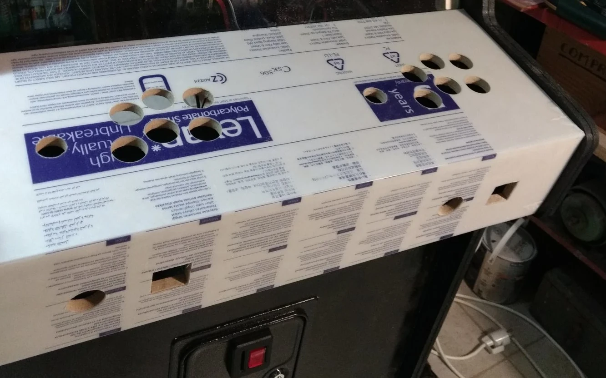

# VersusBox arcade cabinet CAD files

VersusBox cabinet has been designed with FreeCAD.
In this repository are all the required wooden parts and glass CAD files:

- **assembly.FCStd**: all parts assembly,
- **side.FCStd**: sides shape,
- **marquee.FCStd**: the marquee,
- **speaker_panel.FCStd**: spakers panel, on top of screen,
- **glass.FCStd**: screen protection glass,
- **control_panel.FCStd**, **ctrl_panel_front.FCStd**,
  **ctrl_panel_bottom.FCStd**: 2-players control panel parts,
- **front.FCStd**: bottom front part, where you can install coin facade,
- **bottom.FCStd**: bottom plate, under the cabinet, on which you can install
  70mm height casters, it also serves as subwoffer area ceil,
- **back_bottom.FCStd**: bottom back part,
- **back_bottom_door.FCStd**: back bottom door, gives access to the computer,
- **connector_panel.FCStd**: back connector panel (power supply, Ethernet,
  HDMI, USB Neutrik connectors ...),
- **back_top_door.FCStd**: back top door, gives access to display, audio, and
  power supply components,
- **fan_plane.FCStd**: back top fans plate,
- **top.FCStd**: top part,
- **internal_plate.FCStd**: an internal plate to strengthen the structure and
  to install electronics components,
- **internal_separator.FCStd**: an internal plate to strengthen the structure
  and to separate computer and cash box.

There are also models for optional accessories (accessories folder):

- **back_panel.FCStd**: a back panel to mount on **connector_panel.FCStd**
  part, which can provide audio control buttons, additional buttons or
  connectors,
  It is suitable for 3D printing for easy upgrades if you want to add buttons
  or connectors,
- **junction_box.FCStd** and **junction_box_top.FCStd**: a junction box,
  suitable for 3D printing,
- **light_button_front.FCStd**: inset replacement part for white illuminated
  credit button, suitable for 3D printing, you can print it in the wanted
  illumination color to replace the default white color,
- **hdmi_hub_support.FCStd**: support compliant with severak square case HDMI
  splitters,
- **transfo_fixing.FCStd**: A/C transformer support, for 61x50mm transformers,

and placeholders for internal parts (placeholders folder):

- **LM240WU2-SLA1_display.FCStd**: LM240WU2-SLA1 LCD display.

## Hardware choices

### Display

I have selected LM240WU2-SLA1 LCD display for this project because it is:

- inexpensive and easy to find,
- very good view angles,
- 4:3, which is best for retrogaming,
- good image quality (brightness, colors).

It was used by Apple iMacs between 2007 and 2009.

I have connected it to PC HDMI using an HDMI to LVDS convertion board.
It also requires a dedicated power supply board.

### System

A regular PC running Debian and EmulationStation is used.
It uses an Nvidia graphics card.

### Audio

In the bottom of the cabinet, an area has been reserved to make a subwoofer.

## Implementation tips

### Decoration

Make your graphic elements at a 1:1 scale at 150 dpi.
Print them on matte monomeric vinyl, with UV lamination.

The marquee is not backlit, I chose to do something different with an
overflowing rounded-borders plate.

### Screen protection glass

For screen protection, I recommend using 6mm safety glass instead of
plexiglass. Indeed, it is more sustainable against stripe marks.

You can back paint it to let transparent only the area for the display.

Use rubber washers to screw it on metal plate supports in order to avoid break.

### Control panel protection

I recommend using 0.75mm plexiglass plate to protect the control panel decoration.
Moreover, it is advised to bend the plate to cover the top and the front of the
control panel, and not only the top, to avoid unsightly deformation due to
temperature.

